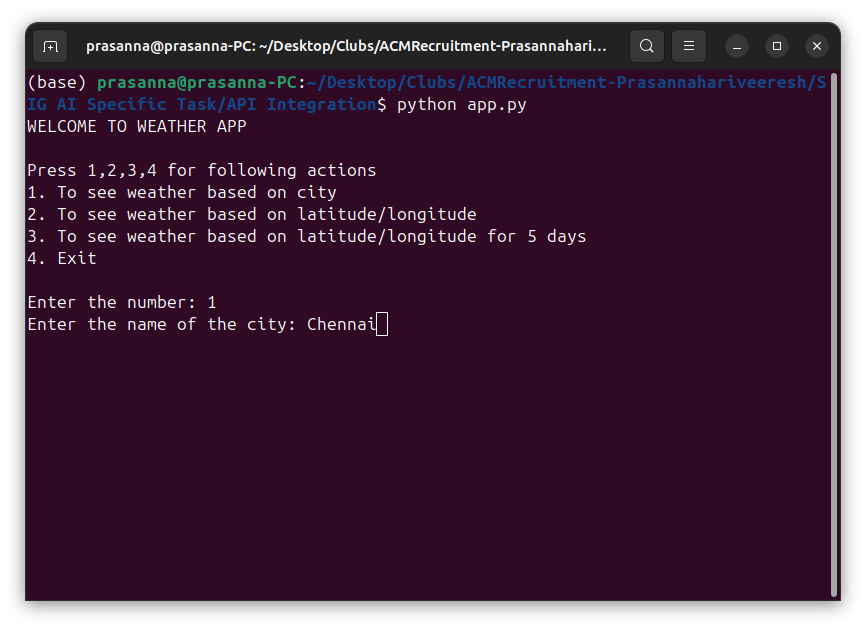
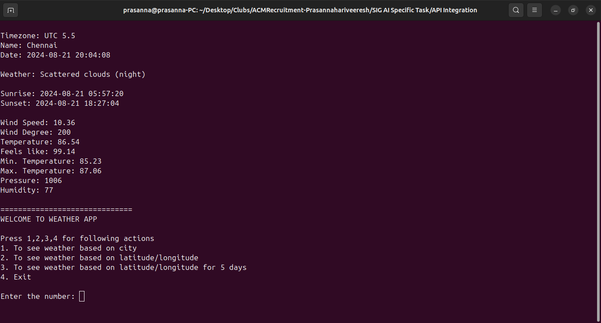

# SIG Specific Task - API Integration

I have been asked to use API to fetch and display crucial data from OpenWeather API from RapidAPI. 

```
API Integration
├── app.py
├── config.json
└── README.md
```
`app.py` is the main entry point with two functions, `get_weather_data` and `display_weather_data`.

`get_weather_data` function gets the data from the API and returns the value. Whereas, `display_weather_data` function prints the dictionary to user readable form

`config.json` is the configuration file that contains RapidAPI URL Endpoints, RapidAPI Key and RapidAPI icon to text mapping

To run this on your system enter your API key in `config.json`

## Output
Input:


Output:
