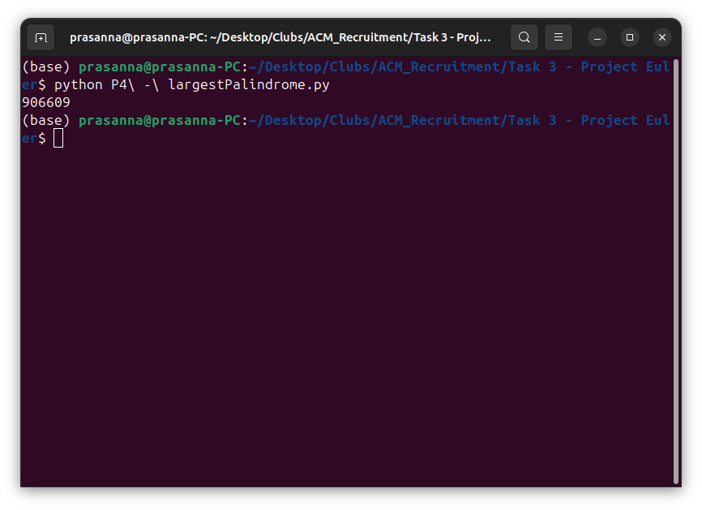
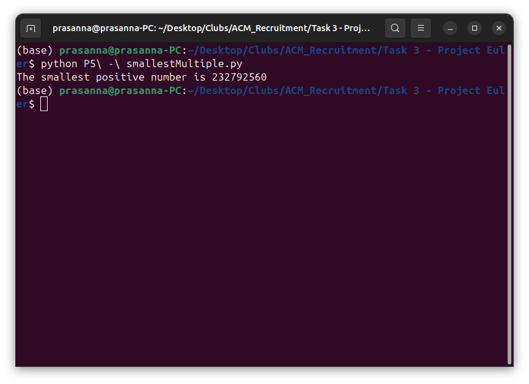
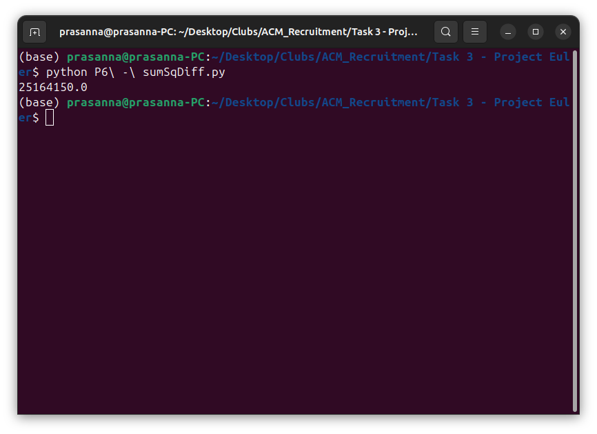
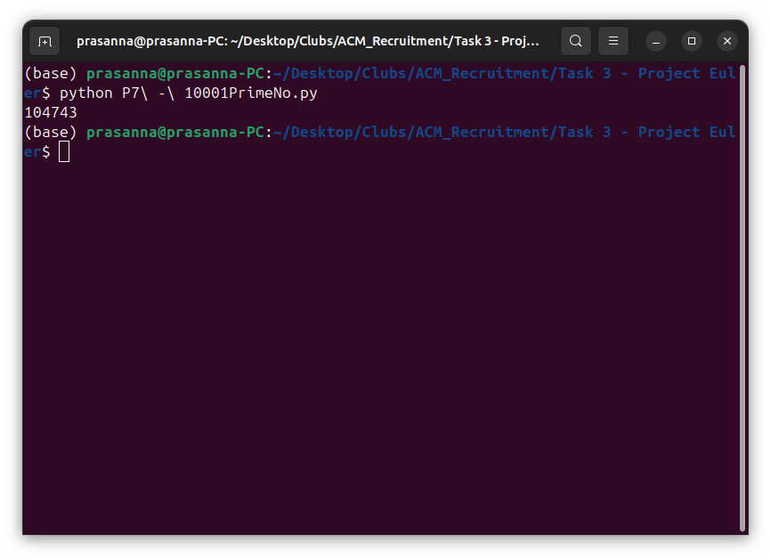
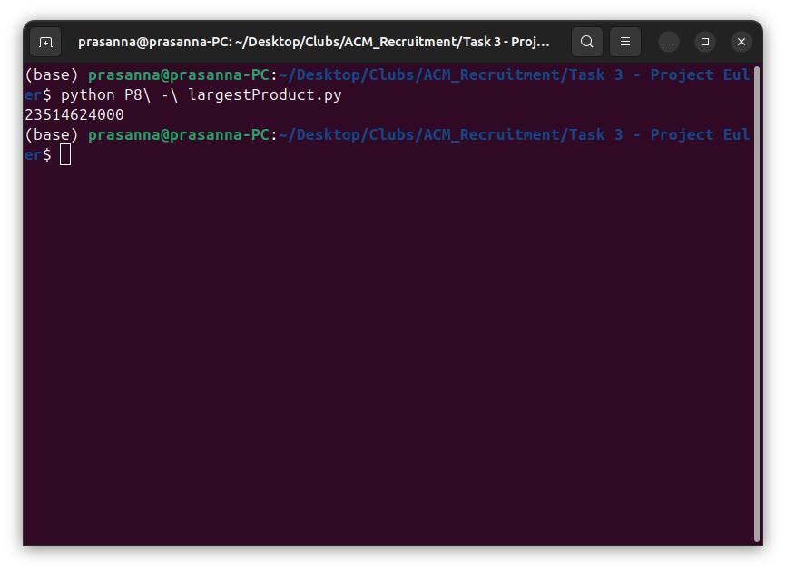

# Project Euler

This task is completed by solving problems 4, 5, 6, 7, 8 from Project Euler's first 10 questions.

## Problem 4: Largest Palindrome Product
In this problem I was asked to find the largest palindrome made from the product of two 3-digit numbers.

I solved this problem using python by iterating all the numbers from 999 to 100 in a nested loop and multiplied each number and checked whether it is a palindrome or not, if it is the maximum of previous palindrome and current one will be considered to reduce memory size

Output:

## Problem 5: Smallest Multiple
In this problem I was asked to find the smallest positive number that is evenly divisible by all of the numbers from 1 to 20.

I solved this problem using python by finding LCM of numbers from 1 to 20 recursively

Output:

## Problem 6: Sum Square Difference
In this problem I was asked to find the difference between the sum of the squares of the first one hundred natural numbers and the square of the sum.

I solved this problem by using the two formulas

    n(n+1)/2 --> Sum of 'n' Natural numbers
    n(n+1)(2n+1)/6 --> Sum of squares of 'n' Natural numbers

And then subtracted them

## Problem 7: 10001st Prime Number
In this problem I was asked to the find the 10001st prime number

I solved this problem by checking every odd number starting off from 3 to verify is this a prime number or not and stops after finding 10001 prime number

## Problem 8: Largest Product in a Series
In this problem I was asked to find the thirteen adjacent digits in the 1000-digit number that have the greatest product.

I solved this problem by iterating all elements and slicing every 13th element and maintaining the maximum product for every loop

## Outcomes
By solving all these problems, my problem solving ablity and the way of approaching a problem is improved.