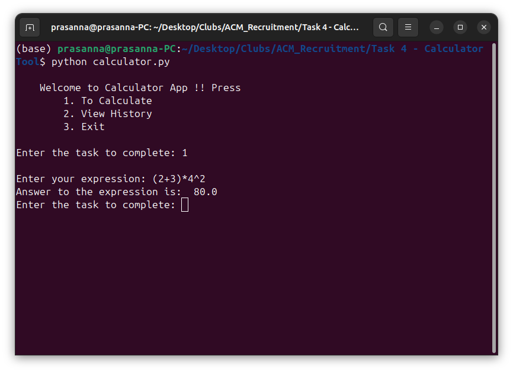
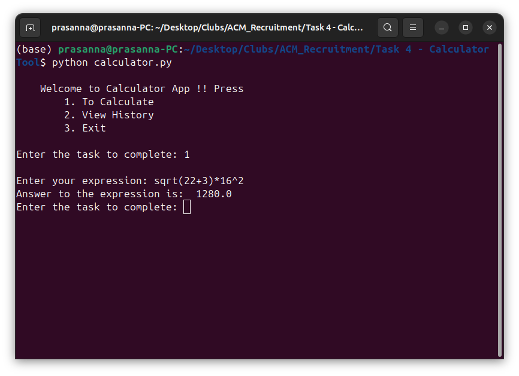

# Calculator app
In this task I was asked to build a calculator app to solve big expressions.

## Requirements
1. **Basic Operations:** Implement addition, subtraction, multiplication, and division.

2. **Advanced Operations:** Include square roots and exponents.

3. **Order of Operations:** Ensure the calculator respects the
order of operations (Parentheses, Exponents,
Multiplication, Division (left to right), Addition, and
Subtraction (left to right)).

4. **Parentheses Handling:** Support for parentheses to dictate
the order of operations.

5. **Error Handling:** Provide meaningful error messages for
invalid inputs, such as division by zero or malformed
expressions.

6. **Object-Oriented Design:** Structure your code using classes
and objects. Implement separate classes or methods for
different functionalities (e.g., operations, expression
parsing).

7. **User Input:** Allow the user to input mathematical expressions in a single line, e.g., `(2+3)*4^2`.

## Approach
I have approached this task by splitting this into different layers of processing

At first, the inputted expression will be tokenized by the `_tokenizer()` function in the `Calculator` class and converted into a list of numbers, operators and brackets seperately.

After tokenizing, the programme will look for any open parentheses and solves the expressions inside the parentheses. This is taken care by the `_eval_parentheses()` function in the `Calculator` class.

After solving parentheses we will iterate till the we reduce the length of `tokens` list to 1, the algorithm searches for operator of higher precedence solves that reduces the size of the tokens and repeats till the equation is solved completely.

## Screenshots

1. **Solving expression `(2+3)*4^2`**

2. **Solving expression `sqrt(22+3)*16^2`**

