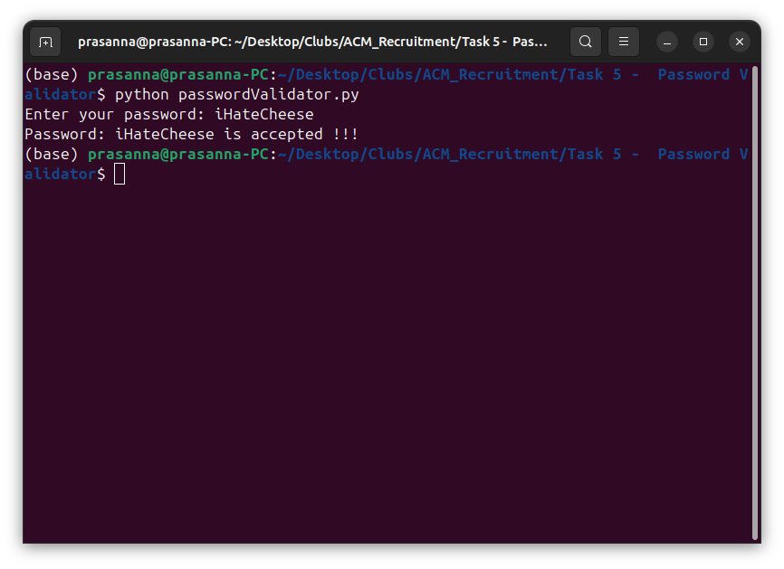
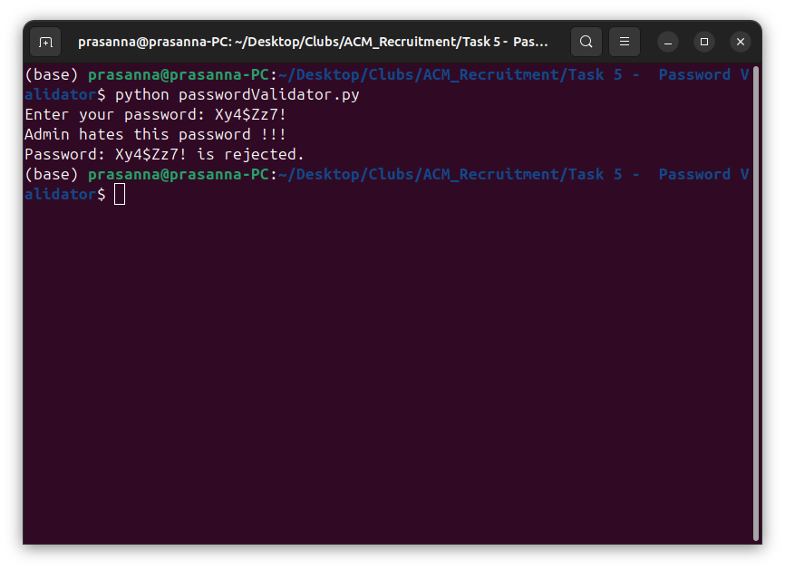

# Password Validator

In this task I've built a simple app to get password as an input from the user and check whether the password passes the given critirea

## Requirements
1. Length 8

2. Contains at least one capital letter and one small letter

3. Contains at least one special character

4. Should not start with a number or special character

5. `passwords = [ "A1b#cD3e", "Xy4$Zz7!", "P@ssw0rd", "M!n3r4L^", "T7r$eN8f" ];`

    I don't want these passwords to be accepted

6. The function should return an error message if the password is not valid

## Approach
I used a function to recieve input from the user and verify whether the string inputed contains
1. 8 charecters or more
2. Has atleast one uppercase and lowercase letter
3. Rejects if the first charecter is a number or special charecter

If all these conditions are passed, the programme will display that the password is accepted

## Screenshots

1. **Password `iHateCheese`**

2. **Password `Xy4$Zz7!`**

