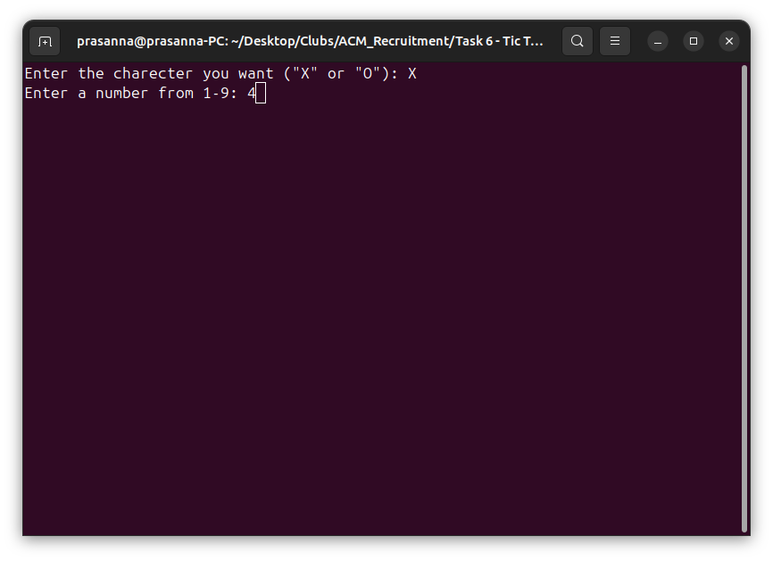
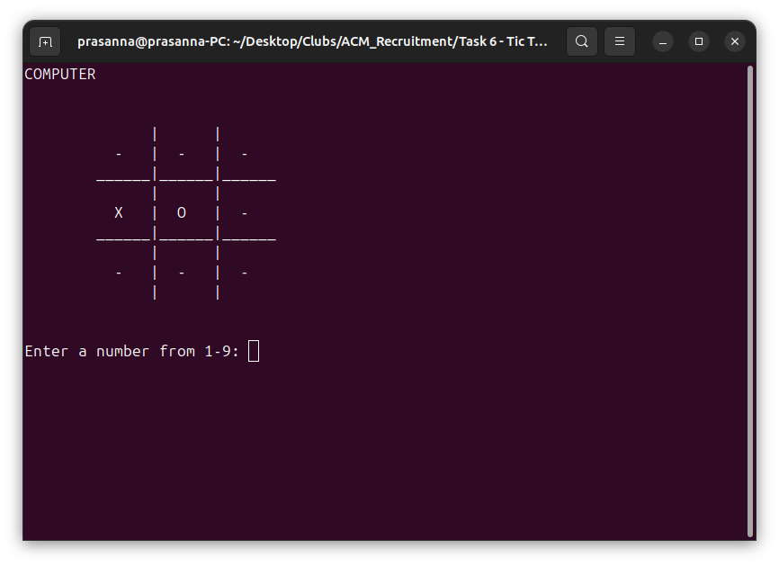
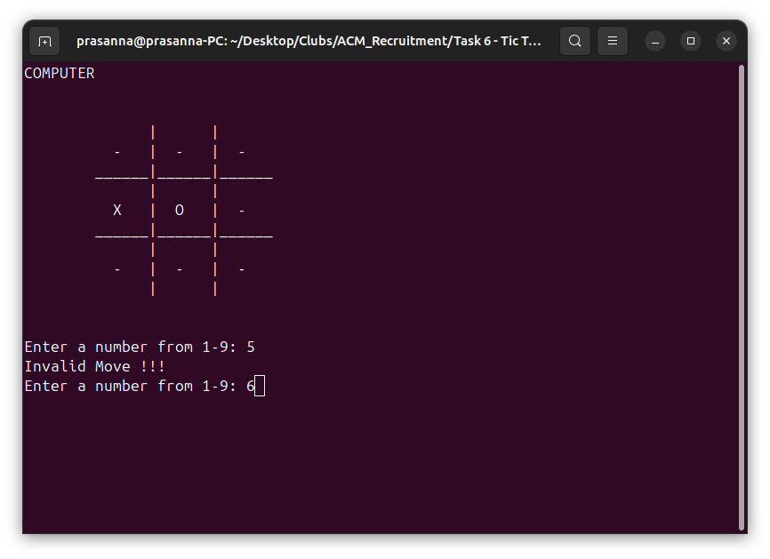
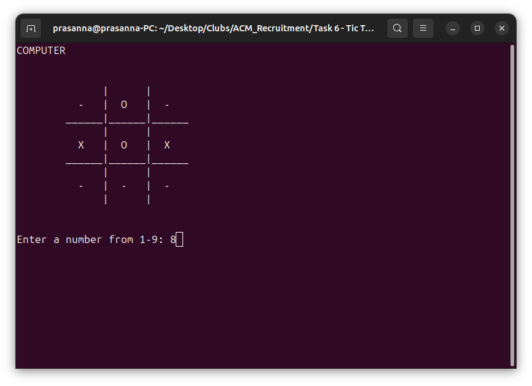
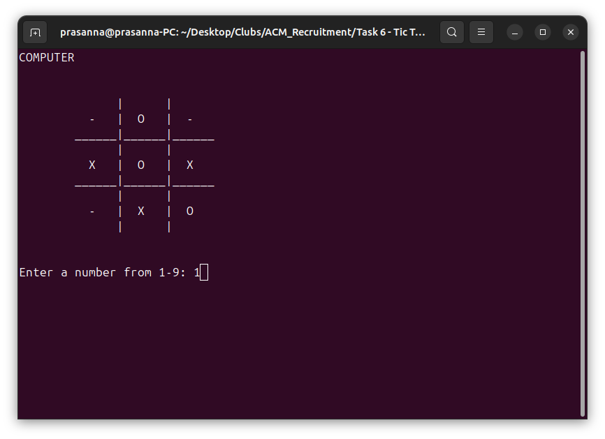
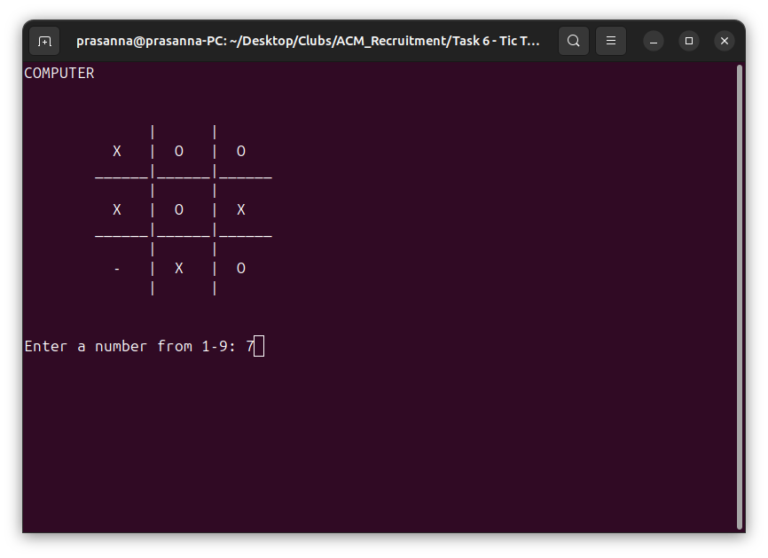
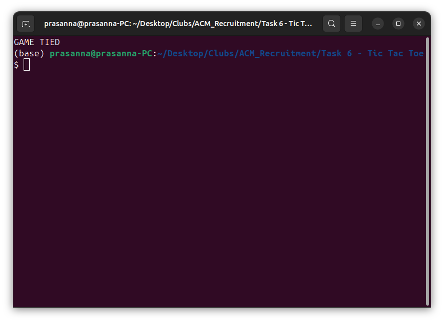

# Tic-Tac-Toe Game
In this task, I've been asked to develop an application to play Tic-Tac-Toe Game. I used python to develop this application and followed an object oriented style

## Requirements

1. Implement a single-player Tic-Tac-Toe game where the player plays against the computer.

2. The computer should make random moves.

3. The player should input their moves via the command line.

4. If the player attempts to make an invalid move (e.g., selecting an already occupied position), the game should display an "Invalid Move" message.

5. The game should correctly manage win conditions and draw scenarios.

## Approach
I have created a `TicTacToe` class which has a function called `initialize_player()` that accepts input from the user to choose anyone from **X** or **O** and rejects any other charecters.

After initializing the player, the application enters a loop and gets input from the user to place their X or O in the desired position, this is done  by the `make_move()` function.

Once the move is made the game state checks whether there is any possibility of anyone winning, and this is taken care by `validate_result()` function. The function has all the possibilities of winning the game and checks whether any one of the criteria is met. If so, the game announces the winner and ends. This function also checks whether the game is tie or not.

After validation, the game thinks of move and makes next step. This is done by `think_move()` function. The function gets a random available position in the board and places its X or O in that position. After this, the application will again call the `validate_result()` function and checks for any win possibilities.

## Screenshots

