# OverTheWire Bandit War Game

It is a game that is designed to teach players the basics of Linux command line and security concepts. It provides practical experience in navigating the file system, manipulating files, and understanding user permissions. 

## Learning Objective

In this task, I've learnt

1. File system mangement in Linux
2. Opening, editing, reading and searching files in Linux
3. How to use SSH, port forwarding and basic network protocols
4. File and directory permissions in Linux
5. Special permissions and SUID binaries
6. Problem solving and Critical Thinking
7. Finding and Managing hidden files and folders

## OverTheWire Bandit Level Progress

<table>
    <tr>
        <th>Level</th>
        <th>Description</th>
        <th>Key Concepts Learned</th>
        <th>Screenshot</th>
    </tr>
    <tr>
        <td>Level 0</td>
        <td>Connecting to the server using SSH for the first time.</td>
        <td>SSH, basic Linux commands</td>
        <td>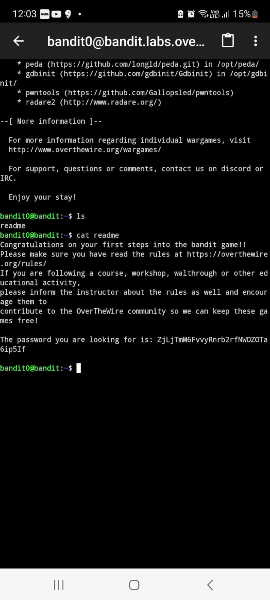</td>
    </tr>
    <tr>
        <td>Level 1</td>
        <td>Finding a file with a specific name and reading its contents.</td>
        <td>File navigation, `cat` command</td>
        <td>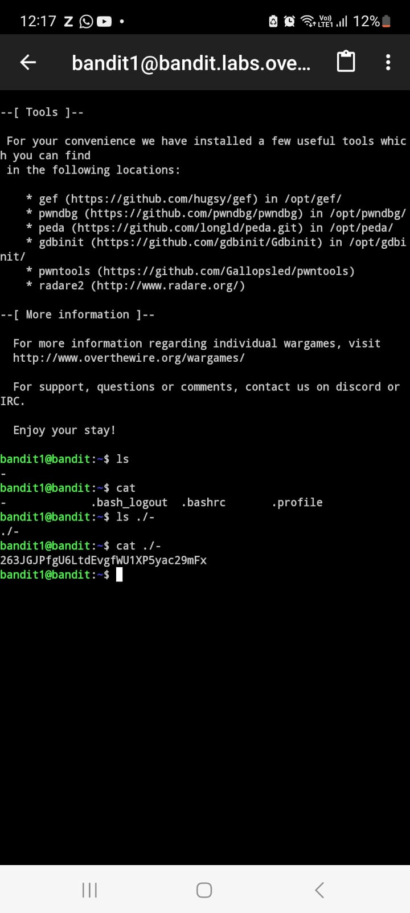</td>
    </tr>
    <tr>
        <td>Level 2</td>
        <td>Locating a file hidden within a directory.</td>
        <td>Hidden files, `ls -a` command</td>
        <td>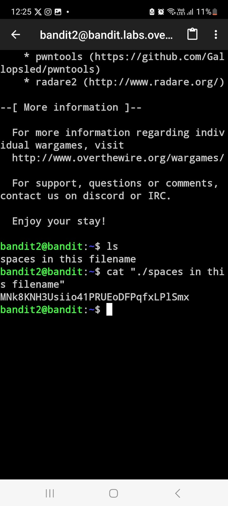</td>
    </tr>
    <tr>
        <td>Level 3</td>
        <td>Identifying a file with a specific size.</td>
        <td>File properties, `find` command</td>
        <td>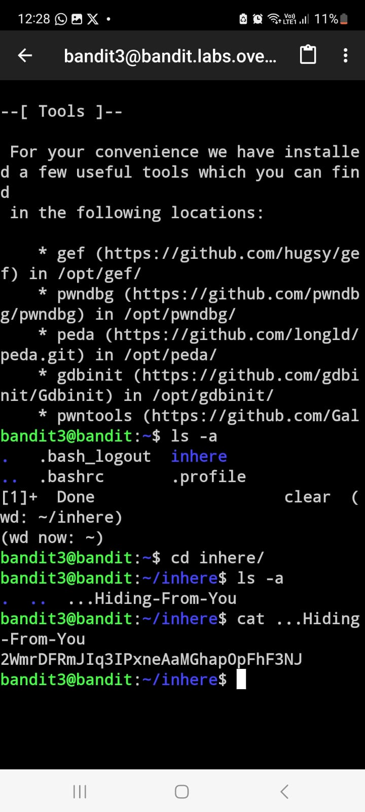</td>
    </tr>
    <tr>
        <td>Level 4</td>
        <td>Reading the contents of a file with spaces in its name.</td>
        <td>Quoting or escaping special characters</td>
        <td>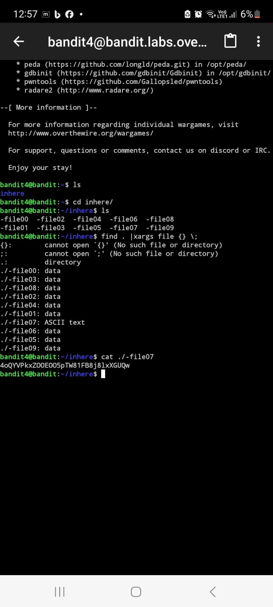</td>
    </tr>
    <tr>
        <td>Level 5</td>
        <td>Finding a human-readable file among a large set of binary files.</td>
        <td>File inspection, `file` command</td>
        <td>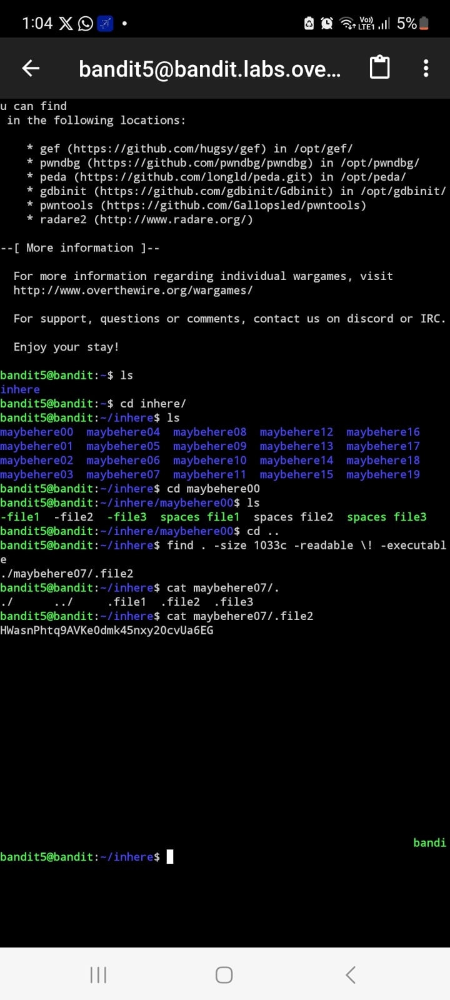</td>
    </tr>
    <tr>
        <td>Level 6</td>
        <td>Using the `find` command to locate files with specific properties.</td>
        <td>`find` command, file permissions</td>
        <td>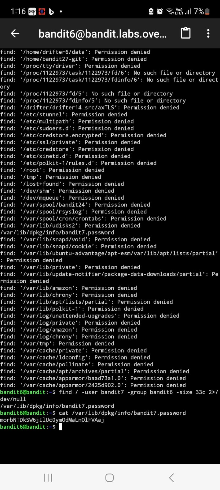</td>
    </tr>
    <tr>
        <td>Level 7</td>
        <td>Identifying a file owned by a specific user and group.</td>
        <td>`find` command with ownership filters</td>
        <td>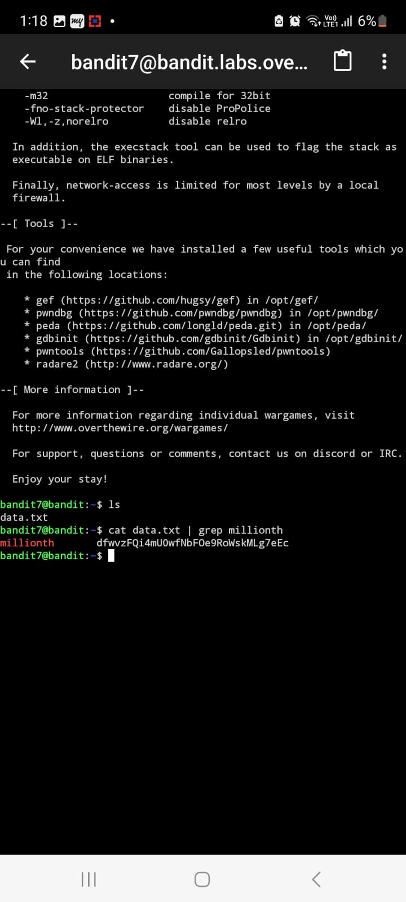</td>
    </tr>
    <tr>
        <td>Level 8</td>
        <td>Searching for a string within a file using `grep`.</td>
        <td>Text search, `grep` command</td>
        <td>-</td>
    </tr>
    <tr>
        <td>Level 9</td>
        <td>Reading the contents of a file with non-printable characters.</td>
        <td>Hexadecimal file viewing, `xxd` command</td>
        <td>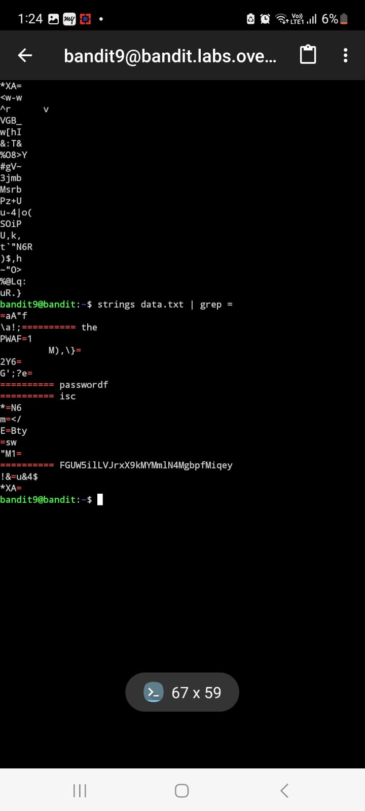</td>
    </tr>
    <tr>
        <td>Level 10</td>
        <td>Base64 decoding of a file's contents.</td>
        <td>Base64 encoding/decoding</td>
        <td>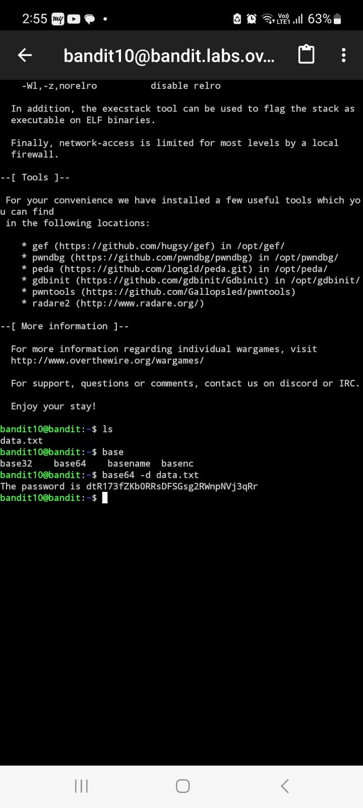</td>
    </tr>
    <tr>
        <td>Level 11</td>
        <td>Rotating a string using ROT13.</td>
        <td>String manipulation, ROT13</td>
        <td>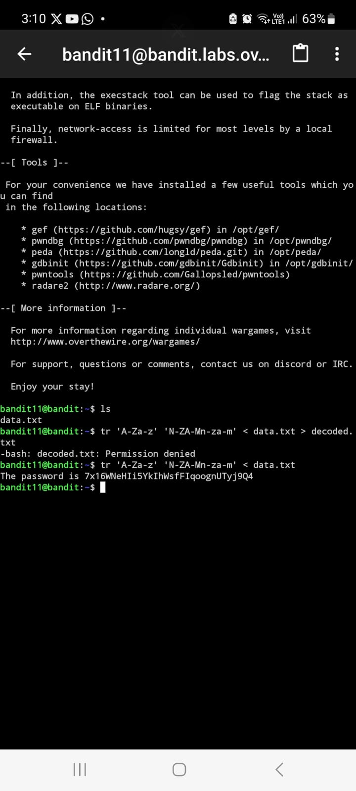</td>
    </tr>
    <tr>
        <td>Level 12</td>
        <td>Gzipping a file and inspecting its contents.</td>
        <td>Compression, `gzip`, `zcat` commands</td>
        <td>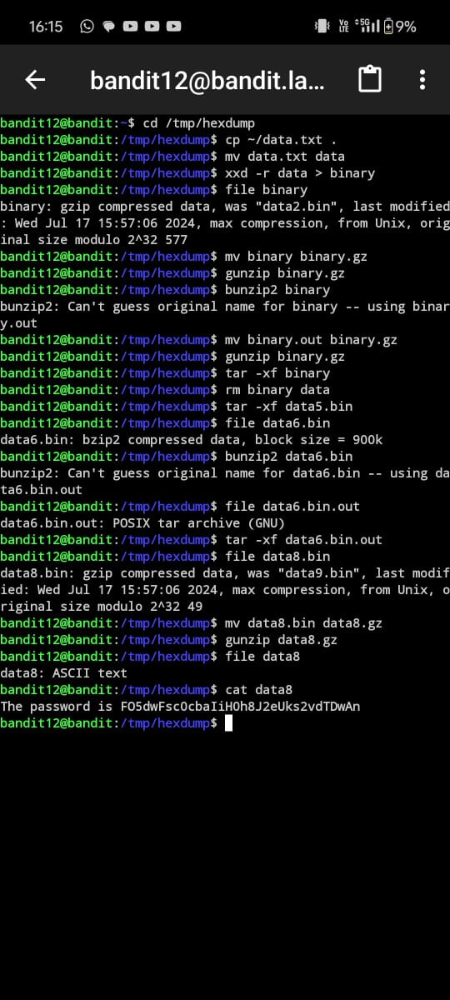</td>
    </tr>
    <tr>
        <td>Level 13</td>
        <td>Decompressing multiple levels of compressed files.</td>
        <td>Compression utilities, `tar`, `bzip2`, `gzip`</td>
        <td>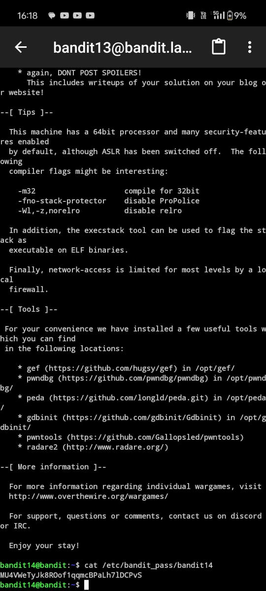</td>
    </tr>
    <tr>
        <td>Level 14</td>
        <td>Sending the password via `nc` (Netcat) and connecting to a port.</td>
        <td>Networking, `nc` command</td>
        <td>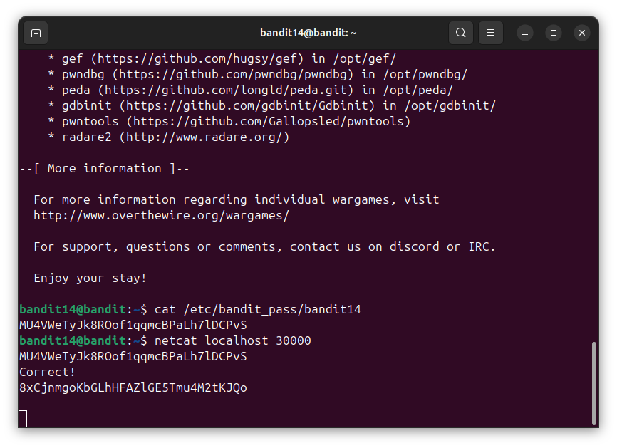</td>
    </tr>
    <tr>
        <td>Level 15</td>
        <td>Using a simple Python script to connect and send data.</td>
        <td>Python scripting, networking</td>
        <td>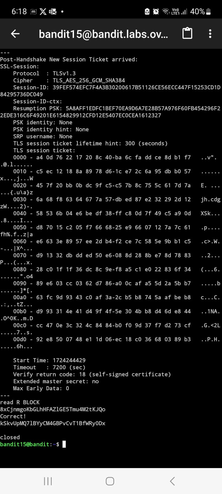</td>
    </tr>
    <tr>
        <td>Level 16</td>
        <td>Using SSL to connect securely to a service.</td>
        <td>SSL/TLS, `openssl` command</td>
        <td>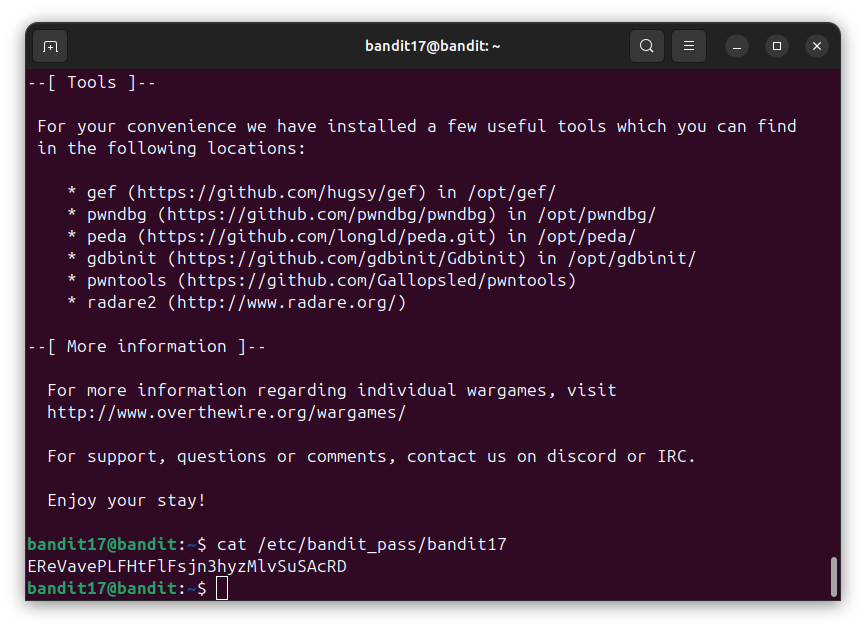</td>
    </tr>
    <tr>
        <td>Level 17</td>
        <td>Finding a password hidden in a log file.</td>
        <td>Log file analysis, `grep` command</td>
        <td>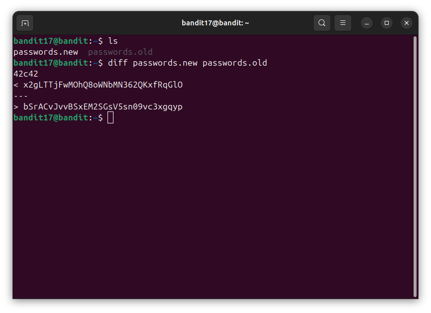</td>
    </tr>
    <tr>
        <td>Level 18</td>
        <td>Understanding and bypassing a simple cron job.</td>
        <td>Cron jobs, file permissions</td>
        <td>-</td>
    </tr>
    <tr>
        <td>Level 19</td>
        <td>Dealing with a password protected file.</td>
        <td>File encryption, `openssl` command</td>
        <td>-</td>
    </tr>
    <tr>
        <td>Level 20</td>
        <td>Finding a hidden file using advanced file searching techniques.</td>
        <td>File search techniques, `find` command</td>
        <td>-</td>
    </tr>
</table>